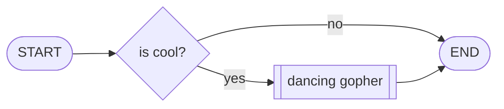

+++ 
draft = false
date = 2024-01-15T16:59:57-06:00
title = "Diagrams"
description = ""
slug = "diagrams"
authors = []
tags = []
categories = []
externalLink = ""
series = []
+++

Built-in support for GoAT diagrams is new since the last time I caught up with Hugo.

```goat
 .-----.
| START |------+
 '-----'       |
               v
               .
              / \
             /   \
        no  / IS  \  yes   .---.
      +----+ COOL? +----->| END |
      |     \     /        '---'
      |      \   /
      |       \ /
      v        '
     .-.
    | X |
     '-'                         
```

Mermaid support turns out to be pretty easy to add, though.


